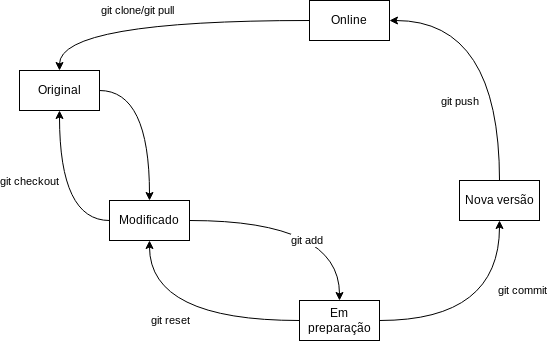

# Introdução

## O que é o git?

O git é um software que serve para fazer **controle de versão**.
Isto é, ele serve para que a gente possa guardar as versões diferentes dos nossos arquivos.

Isso é muito importante quando estamos desenvolvendo software, porque teremos um histórico de todas as modificações que foram feitas.
Assim também podemos voltar facilmente para uma versão estável, caso alguma modificação dê errado.

Além disso, cada vez que salvamos os nossos arquivos no git fornecemos também uma mensagem, explicando o que fizemos e porque fizemos essas modificações.
Depois podemos listar todas essas mensagens com as suas respectivas versões.
Assim podemos encontrar a versão correta que procuramos com mais facilidade.

Por fim, uma das características mais interessantes do git é que ele é **distribuído**.
Isso quer dizer que cada desenvolvedor pode ter a sua cópia independente dos arquivos com todo um histórico de todas as versões.
Por causa disso esse histórico não se perde nunca e podemos até ter versões que tomam caminhos diferentes, ou seja, se ramificam em projetos diferentes.

# Básico

O fluxo básico do git começa com obter os arquivos com os quais vamos trabalhar.
Por exemplo, os códigos fonte dos programas.
Depois de obtidos esses códigos, podemos modificar eles na nossa máquina.
Depois de modificados localmente, precisamos enviar as nossas modificações para o servidor do git para que os outros desenvolvedores possam pegá-las.
Nós também podemos pegar as modificações de outros desenvolvedores que estejam disponíveis no servidor.

E esse ciclo se repete ao longo de todo o desenvolvimento:

1. Obter os arquivos ou modificações
2. Modificar os arquivos
3. Adicionar as modificações localmente
4. Enviar as modificações adicionadas

## Clonar um repositório

Um **repositório** é o nome que o git dá para um lugar onde estão os arquivos.
Muitas vezes também chamamos um repositório de um "repo".
Nós vamos trabalhar com dois tipos de repositórios: o **repositório remoto** e o **repositório local**.

Um repositório remoto é um que fica em outra máquina na rede.
No nosso caso, esse repositório vai ficar mesmo no servidor do Github.
Um repositório local é um que fica na nossa máquina e está diretamente acessível para que a gente modifique.

Em geral, não vamos modificar o repositório remoto diretamente, ao invés disso vamos obter uma cópia dele.
Obter essa cópia, no linguajar do git, é o que chamamos de **clonar** o repositório.

Para clonar um repositório, assumindo que temos acesso à ele, basta digitarmos:

```git clone <endereço_do_repositório> [<nome_do_repositório>]```

Onde `<endereço_do_repositório>` é o endereço do repositório remoto, por exemplo, o endereço desse repositório é <https://github.com/roger-willian/aula-git.git>.
Já o `<nome_do_repositório>` é opcional e, se deixarmos vazio, ele usa o nome que obtém do próprio endereço.
Para testar, execute na sua máquina o comando:

```git clone https://github.com/roger-willian/aula-git.git```

Executar o comando acima copia todo o conteúdo do repositório `aula-git` para uma pasta com o mesmo nome dentro do diretório atual.
Você pode então abrir o arquivo `README.md` e olhar o que tem dentro.

### Configurar nome e email

Antes de sair modificando as coisas e enviar devolta ao Github, é importante que a gente se identifique.
No git isso é bem simples, basta salvar o nosso nome e email.
Assim, qualquer modificação que fizermos vai ficar "assinada" depois.

Para informar o meu nome, por exemplo, escrevo o comando:

```git config user.name="Roger"```

Para informar o meu email, escrevo:

```git config user.email="roger.silva@canoas.ifrs.edu.br"```

## Criar um fork e adicionar colaboradores

Agora, para poder seguir esse tutorial com o seu próprio repositório, crie uma conta no Github e depois clique no botão "Fork" desse repositório aqui, ali em cima e à direita.

Segundo o próprio Github, um fork é uma cópia de um repositório.
Fazer um fork de um repositório permite que você experimente livremente fazendo modificações sem afetar o projeto original.

Para adicionar o seu colega como colaborador do seu repositório, clique no botão "Settings" ali em cima e no meio.
Depois clique em "Collaborators" no menu da esquerda.
Então é só clicar em "Add people" e fornecer os dados do colega.
Use os dados do usuário dele do Github!

Agora que você já fez o fork desse repositório e configurou os colaboradores, delete o clone do repositório original que você tinha criado na sua máquina e faça um novo clone do **seu** fork.
Os colaboradores devem fazer a mesma coisa, isto é, todos devem clonar o **seu** repositório.
Não esqueçam de entrar no diretório `aula-git` e configurar os seus nomes e endereços de email!

## Modificar um arquivo

Tudo configurado? Então digitem o seguinte:

`git status`

Esse comando mostra o status do seu repositório local.
Deve aparecer algo do tipo:

```
On branch main
Your branch is up to date with 'origin/main'.

nothing to commit, working tree clean
```

Isso quer dizer que o seu repositório está igualzinho à versão que você baixou do Github.
Vá em frente e edite esse o arquivo `README.md`, conserte algum erro ou modifique algo que não gostou e salve ele.
Feito isso, digite de novo:

`git status`

Agora a coisa deve ter mudado e deve ter aparecido alguma coisa como:

```
On branch main
Your branch is up to date with 'origin/main'.

Changes not staged for commit:
  (use "git add <file>..." to update what will be committed)
  (use "git restore <file>..." to discard changes in working directory)
        modified:   README.md

no changes added to commit (use "git add" and/or "git commit -a")
```

Essas mensagens indicam que há um arquivo com modificações locais.
Ou seja, você salvou um arquivo modificado, mas não "entregou" ele para o git ainda.
Em alguns terminais esse arquivo aparece até em cor vermelha para indicar isso.

## Adicionar um arquivo para a área de stage

Para indicar para o git que esse arquivo que foi modificado deve ser enviado ao servidor mais tarde, adicionamos ele à área de staging.
Essa é uma área de preparação, onde colocamos as modificações que serão salvas no servidor.
Para fazer isso basta escrevermos:

`git add README.md`

Se executarmos o comando de status novamente, agora vai aparecer:

```
On branch main
Your branch is up to date with 'origin/main'.

Changes to be committed:
  (use "git restore --staged <file>..." to unstage)
        modified:   README.md
```

Agora o git está dizendo que já colocamos um arquivo na área de preparação.
Esse arquivo está pronto para ser salvo como uma nova versão.
Podemos colocar quantos arquivos quisermos nessa área antes de gerar uma nova versão do repositório.
Podemos até criar arquivos novos e adicionar eles desse mesmo jeito.

### Adicionar todas as modificação de uma vez

Como uma última nota, muitas vezes queremos colocar todas as modificações de uma vez só.
Para isso podemos digitar:

`git add .`

Onde `.` significa todo o diretório atual.

## Reverter um arquivo da área de stage

Mas vamos supor que eu me confundi e que esse arquivo não era para ir já nessa versão.
Sem problemas! Eu posso remover ele da área de preparação usando o comando:

`git reset README.md`

Isso não altera nada o conteúdo do arquivo que eu já havia salvo.
Apenas indica ao git que as modificações desse arquivo não fazem parte da próxima versão.
Usem o comando status novamente para ver o que aconteceu.
Esse comando é muito importante e deve ser usado regularmente!

## Reverter uma modificação


Se queremos reverter as modificações que fizemos podemos usar o comando:

`git checkout .`

Onde `.` representa todo o diretório atual. Esse comando descarta todas as suas modificações e deixa os arquivos como eram originalmente, ou seja, na última versão que havia.
Se queremos descartar só as modificações de alguns arquivos podemos trocar o ponto pelos nomes dos arquivos.

## Fazer um commit

Tá, mas chega de brincadeira!
Todo mundo sabe que o professor não se engana! (kkkk)
Então vamos adicionar de novo esse arquivo à área de preparação para podermos criar essa tão falada nova versão.
Um dos colaboradores adiciona na sua máquia o arquivo de novo:

`git add README.md`

Uma nova versão no git é o que chamamos de **commit**, ou seja, um commit nada mais é que um ponto no histórico dos arquivos.
Para fazer um commit, digitamos algo do tipo:

`git commit -m <mensagem>`

Onde `<mensagem>` é uma mensagem descritiva indicando o que eu modifiquei e por que eu fiz essas modificações.
Por exemplo, o mesmo colaborador executa o comando:

`git commit -m "Modifiquei o README.md para testar o git"`

O git vai dizer que adicionou um arquivo com algumas modificações.
Para ver melhor o que aconteceu digite o comando de status novamente.
Deve aparecer algo do tipo:

```
On branch main
Your branch is ahead of 'origin/main' by 1 commit.
  (use "git push" to publish your local commits)

nothing to commit, working tree clean
```

Isso diz que o seu repositório está na frente do repositório original por 1 versão.
Além disso diz que não tem mais nenhuma modificação para ser adicionada.

### Fazer tudo de uma vez só

Como uma última nota dessa seção, às vezes queremos criar uma nova versão com todas as modificações que temos no nosso repositório local.
Para pular o passo de adicionar as modificações, podemos criar uma nova versão adicionando as modificações todas diretamente.
Para isso escrevemos algo do tipo:

`git commit -a -m <mensagem>`

Esse `-a` indica que queremos adicionar tudo antes de criar a nova versão.

## Fazer um push

Muito bem.
Até agora, tudo que você fez foi na sua máquina.
Ou seja, os seus colaboradores ainda não têm acesso às suas modificações.
Para que elas fiquem acessíveis, é preciso enviá-las ao repositório remoto, isto é, ao Github.

O comando que envia as novas versões ao repositório remoto é o comando `push`. Esse comando é simples assim:

`git push`

Mas para poder executá-lo é preciso autenticar com o servidor do Github.
Para isso é preciso de um código de autenticação que o Github chama de *Personal Access Token* (PAT).

Para conseguir ele, clique no seu avatar bem acima e à direita na página do seu repositório.
Depois clique em "Settings" e no menu à esquerda e bem em baixo clique em "Developer settings".
Em seguida clique em "Personal access tokens" e "Generate new token".
Digite um nome para o seu token e marque a caixinha "repo".
Clique em "Generate token" e __copie o código gerado__ porque ele nunca mais ficará visível!

Depois de tudo isso, agora sim, basta digitar o comando:

`git push`

Quando o git pedir o usuário, digite o seu nome de usuário, o meu por exemplo é `roger-willian`.
Quando o git pedir a senha, cole o seu token e dê enter.

Pronto! Se tudo correu bem, o git deve dar uma mensagem como essa:

```
Username for 'https://github.com': roger-willian
Password for 'https://roger-willian@github.com': 
Enumerating objects: 8, done.
Counting objects: 100% (8/8), done.
Delta compression using up to 8 threads
Compressing objects: 100% (4/4), done.
Writing objects: 100% (6/6), 4.42 KiB | 2.21 MiB/s, done.
Total 6 (delta 1), reused 0 (delta 0)
remote: Resolving deltas: 100% (1/1), done.
To https://github.com/roger-willian/aula-git.git
   9064033..55bbb35  main -> main
```

Isso indica que você conseguiu enviar as suas modificações para o seu repositório remoto no Github.

## Fazer um pull

Ok, mas como saber se os arquivos foram parar mesmo lá no Github?
Bom, primeiro podemos ir direto lá na página do nosso repositório no Github.
Dê uma navegada lá e veja se você consegue identificar onde aparecem as suas modificações.

Agora o/a seu/sua colega colaborador/a pode pegar essa modificações.
Para fazer isso, essa outra pessoa deve digitar na máquina dela e dentro do diretório do repositório local:

`git pull`

Isso vai buscar as modificações que já estiverem no servidor do Github e trazer para o repositório local dos colaboradores.

Podemos serguir fazendo isso indefinidamente:
Uma pessoa faz um pull, modifica algumas coisas e faz um commit e um push.
Outra pessoa pega essa modificações novas com outro pull, modifica, faz outro commit e outro push.
E assim sucessivamente.

O problema só aparece se duas pessoas modificarem a **mesma** versão dos arquivos e tentarem enviar as modificações.
Essa situação gera o que chamamos de um **conflito**, porque as modificações são conflitantes.
Nesse caso não tem como o git saber qual é a versão correta e cabe a nós, desenvolvedores, resolvermos esse conflito.

Esse é um assunto mais pra frente.
Mas antes de entrarmos nesse assunto, vamos ver como listar as versões que temos e fazer uma pequena revisão.

### Listar as versões

A qualquer momento podemos ver todas as versões que estão salvas até o momento no nosso repositório local, sejam elas nossas ou versões que os colaboradores enviaram e nós baixamos.
Para tanto usamos o comando:

`git log`

Simples assim! O git vai nos mostrar uma lista de commits mais ou menos assim:

```
commit 55bbb353b58cf2a743d6680d218c1dc83582707d (HEAD -> main, origin/main, origin/HEAD)
Author: Roger <roger.silva@canoas.ifrs.edu.br>
Date:   Wed Aug 10 18:40:21 2022 -0300

    Adiciona mais um pouco

commit 77f377e71c0cab31b0c05b7ad75b3b23e0d638b8
Author: Roger <roger.silva@canoas.ifrs.edu.br>
Date:   Wed Aug 10 18:16:41 2022 -0300

    Modifiquei o README.md para testar o git

commit 90640330a5514d210ce563e483e74c52db49b1d9
Author: Roger <roger.silva@canoas.ifrs.edu.br>
Date:   Wed Aug 10 17:20:29 2022 -0300

    Primeiro commit

commit a91b422ec8e92547a41d1d585276a1e67e9cc0cb
Author: Roger Willian <roger.silva@canoas.ifrs.edu.br>
Date:   Wed Aug 10 17:16:14 2022 -0300

    Initial commit
```

Os commits mais novos vêm primeiro. Note que cada versão tem uma mensagem junto indicando quais modificações foram inseridas naquela versão.

## Resumo até aqui

Até aqui vimos o fluxo básico do git que está resumido na figura abaixo.



Começamos criando um repositório novinho ou criando um fork de um repositório de outra pessoa.
Nesse ponto, os arquivos, se houver algum, estão no nosso repositório remoto, ou seja, online.

Para poder modificar esses arquivos, fizemos um `git clone` desses arquivos originais na nossa máquina local.
Aí então, podemos modificar esses arquivos e eles ficarão em um estado pendente, modificado.

Se eu me arrepender dessas modificações posso simplesmente descartá-las com um comando `git checkout`.
Mas se eu gostei delas, posso dizer ao git para adicionar essas modificações na próxima versão.
Faço isso com o comando `git add`.

Agora as modificações estão em preparação para criar uma nova versão.
Se eu quiser voltar atrás ainda dá, basta usar o comando `git reset`.
Mas se está tudo bem, posso criar a nova versão usando um comando `git commit`.
Agora só posso seguir em frente.

O próximo passo é publicar essa minha nova versão para que os meus colaboradores possam pegar todas as minhas modificações.
Para publicar a minha versão eu uso o comando `git push`.

Quando as versões estiverem publicadas, todo mundo que já clonou o repositório pode simplesmente fazer um `git pull` que vai obter as novas modificações.

Para ver as versões que estão disponíveis posso usar um `git log` e para ir para uma versão específica posso usar:

`git checkout <commit>`

Onde `<commit>` é o código que aparece ao lado do commit no log.

# Um pouco mais de Git

Aqui vamos entrar em uns tópicos um pouco mais avançados.

## Evitar um conflito

Mais adiante vamos falar de como resolver um conflito no git.
Porém, antes disso, vamos primeiro ver como podemos evitar esses conflitos.
A estratégia para evitar conflitos é basicamente:

- Evitar mexer no mesmo arquivo ao mesmo tempo que os colaboradores;
- Sempre fazer um `git pull` antes de começar a modificar os arquivos;
- Fazer poucas modificações antes de cada `git commit`;
- Fazer `git push` frequentemente.

Ou seja, em se tratando de software, isso quer dizer:

- Dividir bem o software em arquivos de maneira que fiquem coesos e desacoplados. Se um desenvolvedor tem que mexer em um arquivo ele provavelmente terá que mexer em um subconjunto bem definido de arquivos relacionados com aquele. De preferência esse subconjunto deve ser pequeno.
- Dividir bem as tarefas para que cada desenvolvedor fique com um conjunto pequeno de modificações a serem feitas. As tarefas de cada desenvolvedor devem ser bem relacionadas de maneira que ele não mexa nos arquivos que os outros desenvolvedores estão mexendo.
- Fazer versões pequenas e publicar frequentemente. Se as modificações são poucas, elas podem ser feitas e publicadas em um dia, liberando os arquivos para que sejam modificados por outros desenvolvedores. Assim a chance de acontecer um conflito é minimizada. Além disso, essa é uma boa prática da engenharia de software porque permite compartimentar os problemas dentro de versões pequenas. Assim fica mais fácil consertar os bugs depois.

## Resolver um conflito

Quando dois commits modificam a mesma parte de um arquivo o git pode não ser capaz de encontrar a melhor maneira de juntar as modificações.
Nesse caso ocorre um conflito, que vai ser indicado por uma mensagem mais ou menos assim:

```
Auto-merging README.md
CONFLICT (content): Merge conflict in README.md
Automatic merge failed; fix conflicts and then commit the result.
```

Nesse caso, se abrirmos o arquivo com conflito vamos encontrar o problema marcado com sinais de >>, == e << mais ou menos assim:

```
 <<<<<<< HEAD
 Mas, antes disso vamos primeiro ver como podemos evitar esses conflitos.
 =======
 Porém antes disso, vamos primeiro ver como podemos evitar esses conflitos.
 >>>>>>> 4efdd196e3e837494bee185f3ee0e5dbf0249e35
```

A parte de cima, depois da linha `<<<<<<< HEAD`, é nossa versão, com as nossas modificações.
Já a parte de baixo entre as linhas `=======` e `>>>>>>> 4efdd196e3e837494bee185f3ee0e5dbf0249e35` são as modificações de um outro colaborador.
Esse código bem grande é o código do commit que a outra pessoa fez.
Além disso podem ter vários conflitos no mesmo arquivo e temos que tratar cada um deles.

Para resolver o conflito, é preciso ler e entender o melhor jeito de juntar as duas modificações.
Depois disso substituímos cada bloco com conflito pela versão correta, salvamos e fazemos um novo `git commit`.

## Criar um branch

Como vocês já devem ter visto, o git tem um fluxo de trabalho um pouco mais complexo do que, por exemplo, editar arquivos compartilhados no Google Docs.
Mas isso tudo facilita o controle das versões do software e, no final das contas, trabalhar com o git é um esforço que vale a pena.

Entretanto, devemos tomar alguns cuidados quando trabalhamos com uma equipe de desenvolvedores.
Do contrário, vamos passar o dia todo resolveldo conflitos e outros problemas que podem aparecer.
Uma das técnicas usadas para manter as coisas sãs é o emprego de ramos ou *branches*.

Um ramo é como se fosse um pequeno desvio no histórico dos arquivos.
Na verdade desde o início desse tutorial estávamos usando um ramo.
Esse ramo é o ramo principal ou `main`, muitas vezes chamado de `trunk`.

Quando criamos um novo ramo, em geral, criamos uma cópia de trabalho dos arquivos.
Isso quer dizer que nesse novo ramo podemos fazer as modificações que quisermos sem afetar o ramo principal.
Depois que estivermos satisfeitos com as modificações que fizemos em um ramo, podemos escolher juntar essas modificações de volta para o ramo principal ou até mesmo descartá-las.

Para criar um ramo apenas na nossa máquina local, basta digitar:

`git branch <nome>`

Onde `<nome>` é o nome que queremos dar ao novo ramo.
O comando a seguir, por exemplo, cria um novo ramo chamado `meu_ramo`:

`git branch meu_ramo`


## Fazer um merge

# Avançado

## Criar um repositório

## Criar um pull request

## Fazer um code review

## Aceitar um pull request


